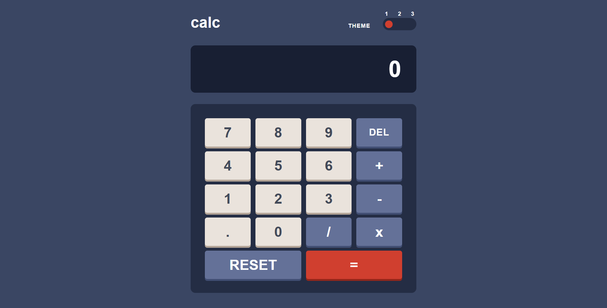

# Calculator App

## Overview & Project Scope

Welcome to the **Calculator App**, a modern, highly responsive, and robust web calculator. The design standards prioritize accessibility, optimal performance, and strict adherence to modern UI/UX patterns.

## Hero Preview



## Links

- **Live Demo URL:** [https://ahmed-let-front.github.io/calc-app/](https://ahmed-let-front.github.io/calc-app/)
- **Frontend Mentor Solution:** [https://www.frontendmentor.io/challenges/calculator-app-9lteq5N29](https://www.frontendmentor.io/challenges/calculator-app-9lteq5N29)

## AI Collaboration

- 🤖 **UI & Layout Assistance:** AI collaboration was utilized exclusively to assist with structuring and refining the user interface (UI) and layout architecture. All core calculation logic and programming were independently engineered and implemented by the author.

## Core Features & Logic Pipelines

- ⚙️ **Dynamic Calculation Engine:** Secure expression evaluation utilizing robust third-party parsing logic, replacing unsafe native methods to handle continuous operations and precision handling safely.
- 📜 **Scrollable Multi-Element Display:** Engineered with dynamic `span` separation for operands and operators, backed by clean CSS overflow handling and custom horizontal scrolling mechanics.
- 🎨 **Interactive Theme Switcher:** Seamless switching between multiple distinct visual themes tailored using Tailwind CSS with dynamic footer branding adaptation.
- 📱 **Responsive Keypad Grid:** Fully optimized CSS Grid layout ensuring precise touch and click targets across mobile, tablet, and desktop devices.
- 🛡️ **State Persistence & Error Management:** Robust handling of edge cases such as division by zero, overflow inputs, and rapid successive inputs.

## Tech Stack & Implementation Details

- 🧱 **Semantic HTML5 Markup:** Clean, accessible, and structured DOM hierarchy including dynamic branding footers.
- 💻 **Vanilla JavaScript (ES6+ Modules):** Modularized code structure leveraging modern ES6 features (Arrow functions, destructuring, module imports/exports).
- 🎨 **Tailwind CSS v4:** Utility-first styling utilizing advanced features, custom themes, and CSS variables.
- ⚡ **Vite:** Next-generation frontend tooling ensuring ultra-fast HMR (Hot Module Replacement) and optimized production builds.

## What I Learned & Architectural Highlights

Building this calculator provided deep insights into separating UI rendering from business logic, handling edge cases in arithmetic operations, and managing DOM updates efficiently. A major architectural takeaway was learning about the native `eval()` function, understanding how it parses and executes a string as real JavaScript code, and recognizing why it is dangerous because it introduces serious security vulnerabilities (such as code injection) and hinders production code minification. To solve this, I successfully integrated a secure 3rd-party expression parsing library (`expression-eval`). Another key highlight was solving dynamic display overflows using proper flex constraints and scroll management.

Here is a snippet of the custom calculation and display management logic implemented in the project:

```javascript
// Example snippet handling dynamic screen updates and scroll management
const updateScreenDisplay = (currentInput, operator, previousInput) => {
  const screenElement = document.querySelector(".calculator__screen");
  // Ensuring smooth horizontal scrolling adjustment on new inputs
  screenElement.scrollLeft = screenElement.scrollWidth;
};
```

---

## Project Initialization & Local Setup

To run this project locally, follow these steps:

## 1. Clone the repository:

```bash
git clone [https://github.com/Ahmed-let-front/calc-app.git](https://github.com/Ahmed-let-front/calc-app.git)
Navigate to the project directory:
```

## 2. Navigate to the project directory:

```bash
cd calc-app
Install dependencies:
```

## 3. Install dependencies:

```bash
npm install
Start the development server:
```

## 4. Start the development server:

```bash
npm run dev
Build for production:
```

## 5. Build for production:

```bash
npm run build
```

---

## Vite Build Configuration

The project uses an optimized **vite.config.js** file tailored for production asset bundling and vendor chunk splitting:

```javascript
import { defineConfig } from "vite";
import tailwindcss from "@tailwindcss/vite";

export default defineConfig({
  plugins: [tailwindcss()],
  base: "/calc-app/",
  build: {
    sourcemap: false,
    rollupOptions: {
      output: {
        assetFileNames: "assets/[name]-[hash][extname]",
        chunkFileNames: "assets/[name]-[hash].js",
        entryFileNames: "assets/[name]-[hash].js",
        manualChunks(id) {
          if (id.includes("node_modules")) {
            return "vendor";
          }
        },
      },
    },
  },
});
```

---

## Author

GitHub: [ahmed-let-front](https://github.com/Ahmed-let-front)

Frontend Mentor: [Ahmed yasser](https://www.frontendmentor.io/profile/Ahmed-let-front)

LinkedIn: [Ahmed Yasser](https://www.linkedin.com/in/ahmed-yasser-frontend/)

---

**Thanks** Create By **UIO** ❤️
